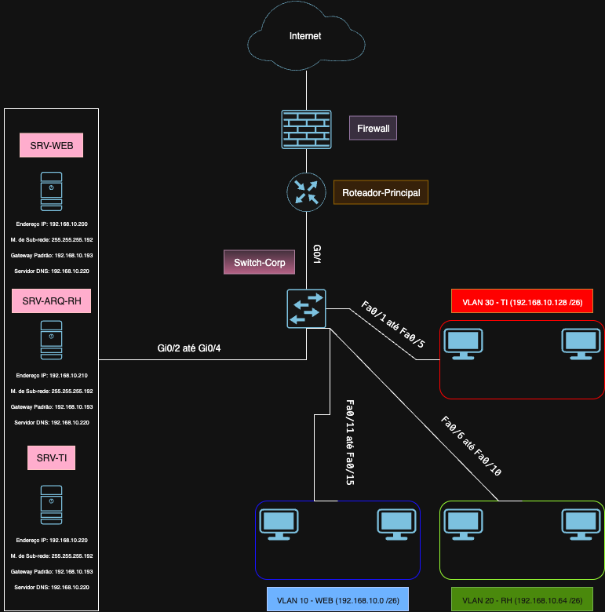
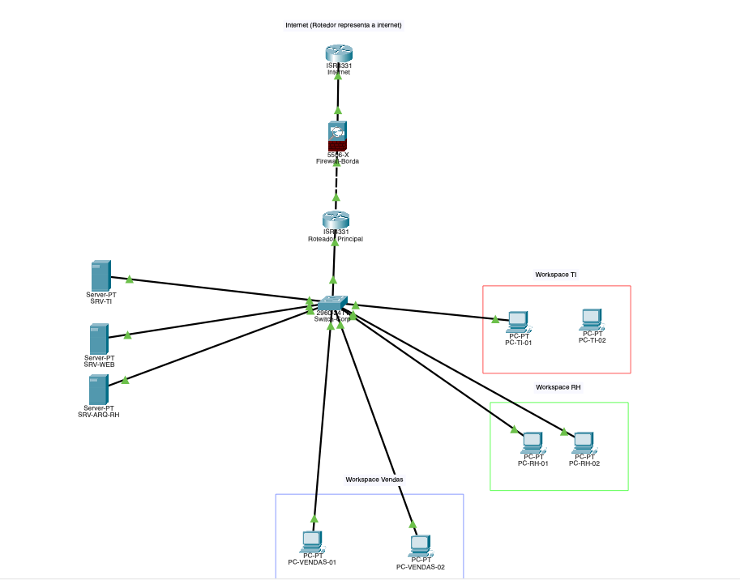

# Projeto: Simulação de Rede Corporativa Segura

  

## 1. Objetivo

Este projeto simula a implementação de uma infraestrutura de rede segura e segmentada para uma empresa fictícia (`SecureCorp`) utilizando o **Cisco Packet Tracer**.  
O objetivo é demonstrar a aplicação prática de conceitos fundamentais de redes e segurança, incluindo:
- Separação de departamentos em VLANs
- Controle de tráfego com firewall de borda
- Configuração de serviços de rede essenciais

---

## 2. Topologia da Rede

A topologia foi desenhada para representar uma rede corporativa padrão, com uma borda segura conectada à Internet e uma rede interna segmentada.

### Diagrama Protótipo

  

### Desenvolvimento no Cisco Pkt

  

---

## 3. Plano de Endereçamento IP

A rede foi projetada com as seguintes sub-redes para cada VLAN:

| VLAN ID | Nome       | Rede                 | Máscara            | Gateway           |
| :-----: | ---------- | -------------------- | ------------------ | ----------------- |
| **10**  | Vendas-WEB | `192.168.10.0 /26`   | `255.255.255.192`  | `192.168.10.1`    |
| **20**  | RH         | `192.168.10.64 /26`  | `255.255.255.192`  | `192.168.10.65`   |
| **30**  | TI         | `192.168.10.128 /26` | `255.255.255.192`  | `192.168.10.129`  |
| **99**  | Servidores | `192.168.10.192 /26` | `255.255.255.192`  | `192.168.10.193`  |

---

## 4. Configurações Implementadas com Sucesso

- ✅ **Segmentação de Rede:** Criação de 4 VLANs no switch principal para isolar o tráfego de cada departamento.
- ✅ **Servidor DHCP:** Pools configurados no roteador principal para distribuição automática de IP, máscara e gateway.
- ✅ **Roteamento Inter-VLAN:** Implementação de **Router-on-a-Stick**, permitindo comunicação controlada entre departamentos.
- ✅ **Arquitetura de Borda:** Firewall Cisco ASA + roteador simulando a Internet, separando rede interna da externa.
- ✅ **Roteamento Estático:** Rotas estáticas no Firewall e no roteador da Internet para garantir fluxo de dados entre borda e LAN.

---

## 5. Desafio Final: Diagnóstico do Problema de Conectividade Externa

Após a implementação, a comunicação interna (Inter-VLAN) funcionou perfeitamente.  
O desafio final foi permitir a comunicação de um cliente (`192.168.10.2`) com a rede externa (`200.20.2.2`).

### Análise e Troubleshooting

1. **Verificação de IP:** `ipconfig` confirmou DHCP funcional (IP, Máscara e Gateway corretos).
2. **Modo de Simulação:** Packet Tracer usado para rastrear pacote ICMP passo a passo.
3. **Análise de PDU:**
   - **Echo Request (ida):** chegava até o destino (`200.20.2.2`).
   - **Echo Reply (volta):** era descartado no `Firewall-Borda`.
4. **Revisão de Configurações:**
   - Tabelas de roteamento verificadas (`show ip route` e `show route`).
   - Políticas de inspeção (`inspect icmp`) ajustadas.
   - ACLs aplicadas em `inside` e `outside`.
   - Função de NAT migrada do roteador para o firewall (*best practices*).
   - Reset de fábrica (`write erase` / `reload`) + reconfiguração completa para eliminar bugs.

---

## 6. Conclusão

Mesmo com todas as boas práticas aplicadas (roteamento, NAT e políticas de firewall), a falha no **ping externo** persistiu.  
Isso indica fortemente uma **limitação ou bug específico do Cisco Packet Tracer** nesta topologia com múltiplos recursos avançados.

Apesar disso, o projeto foi bem-sucedido como **case de estudo**, mostrando:
- A importância do troubleshooting estruturado.
- A aplicação de conceitos de redes e segurança em um ambiente corporativo.
- A necessidade de perseverança e análise crítica em cenários de falha.

---
